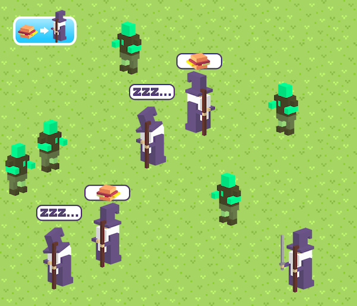

# PRG08 Tentamen

## Gandalf Clicker

Gandalf wordt ook alweer een jaartje ouder. Hij is tegenwoordig vooral een beetje aan het aanrommelen, tenminste als hij wakker is. Om toch nog van nut te zijn in het gevecht tegen het kwaad, heeft hij zichzelf 1000 keer gekloond. Hij heeft nu alleen niet genoeg ontbijt in huis.

- Lees de [Toetsinstructie PDF](gandalfclicker_2016_2017_instructie.pdf) goed door.
- Bekijk de beoordelingscriteria.
- Vul het opleverdocument in voordat je het project inlevert.

## Opleverdocument

**Interface en inheritance**
- waar, waarom
Gandalf.ts, Gandalf extend van gameobject zodat de functies die ork ook heeft niet dubbel opgeschreven hoeven worden. Daarnaast implement gandalf de Observer class, omdat hij moet observeren of er op de knop gedrukt wordt en de subject zeker moet weten dat de observers een notify functie hebben.

**Abstracte class**
- waar, waarom
GameObject.ts, ork en gandalf hebben veel met elkaar gemeen, het is daarom makkelijk om een overkoepelende class te maken(in dit geval GameObject genoemd), omdat deze class zelf nooit een instance van gemaakt hoeft te worden is het een abstracte class.

**Singleton**
- waar, waarom
Game.ts/hungry.ts, er is altijd maar 1 instance van game en het is handig als je hier overal in je game bij kan. Bijvoorbeeld in hungry.ts, want pas als gandalf het hungry gedrag heeft, wil hij reageren op het uitdelen van ontbijt. En de instance van breakfast kan hungry.ts anders niet bij en zou via meerdere constructors doorgegeven moeten worden.

**Polymorfisme**
- waar, waarom
In Game.ts is er 1 array met gameObjects, zodat de update van elke orc en elke gandalf niet apart hoeft aangeroepen te worden, maar in 1 keer kan met this.gameobjects.update, dit is mogelijk omdat elk gameobject een update functie heeft die op zijn eigen manier ingevuld wordt.

**Strategy**
- waar, waarom
Bij gandalf, er wordt nu via een let een string vergeleken die vervolgens door een hele lange case gaat. Door al deze code in een aparte class wordt het veel overzichtelijker. Dit is mogelijk doordat gandalf nooit tegelijk hoeft te slapen en iets anders te doen. Daarnaast staat er nu een hele hoop functies in de gandalf class die de gandalfstates zelf kunnen afhandelen door het aanroepen van Gandalf.state.action(), hiervoor stond ook een switch case in de update functie, wat best onoverzichtelijk wordt vooral zodra het nog wat complexer wordt.

**Observer**
- waar, waarom
De gandalfs luisteren naar breakfast. Als er op de breakfast geklikt wordt, moeten alle gandalfs die hongerig zijn het spel uit lopen. Er zijn dus meerdere observers die een gedragsverandering krijgen zodra er iets met het subject gebeurt.

**Gandalf stuurt kaartje**
- gelukt
Hungry houdt een timer bij die ervoor zorgt dat gandalf weer terug in slaap valt.
Leaving.ts roept de sendCard functie aan wanneer gandalf uit het beeld verdwijnt.

**Game start met random gandalfs en orks**
- gelukt / niet gelukt
Deels gelukt, allebei willekeurig tussen de 1 en de 8 van beiden, random state niet gelukt.